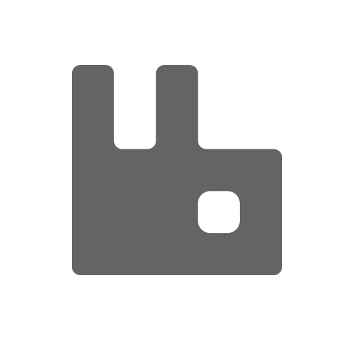
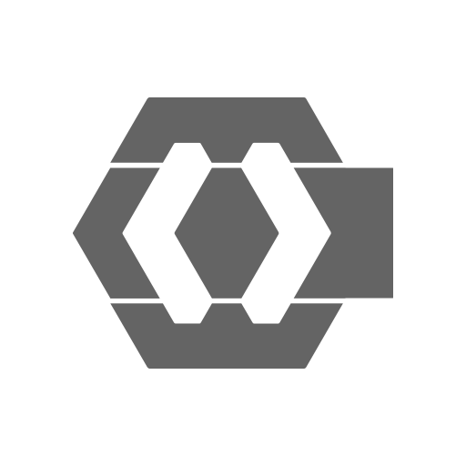
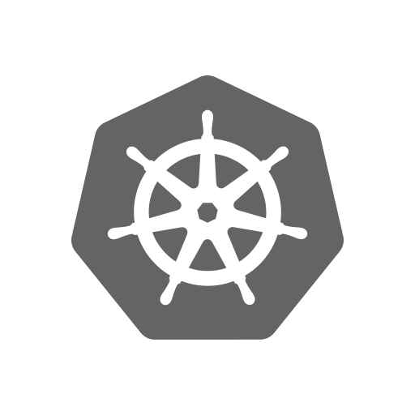

<div align="center">
  <p></p>
  <h1><code>MARKETUP</code></h1>
</div>

<table>
  <tbody><tr><td align="center" width="99999"><div>
    <a href="https://olankens.com">WEBSITE</a> ·
    <a href="https://ko-fi.com/olankens">FUNDING</a>
  </div></td></tr></tbody>
  <tbody><tr><td align="center" width="99999">&nbsp;<div>
    Ecommerce platform of Spring Boot microservices, exposing inventory REST APIs for stock checks and full CRUD operations, wired through RabbitMQ, secured by Keycloak, and deployed on Kubernetes clusters.
  </div>&nbsp;</td></tr></tbody>
  <tbody><tr><td align="center" width="99999">
    <a href="https://spring.io"></a>
    <picture></picture>
    <a href="https://rabbitmq.com"></a>
    <picture></picture>
    <a href="https://keycloak.org"></a>
    <picture></picture>
    <a href="https://kubernetes.io/"></a>
  </td></tr></tbody>
</table>

## PREVIEWS

<table><tbody><tr><td width="99999">
  <picture></picture>
</td></tr></tbody></table>

## LEARNING

### LAUNCH THE CONTAINERS

```sh
docker compose down
docker compose up -d
```

### DEBUG WITH INTELLIJ IDEA

```sh
idea .
```

### USEFUL RESOURCE LINKS

<table>
  <tbody><tr><td width="99999">Keycloak URL</td><td><a href="http://localhost:8080">🌐</a></td></tr></tbody>
</table>

### CREATE MONGODB COLLECTION

```mongodb-json
use product-db
db.createCollection("product")
```